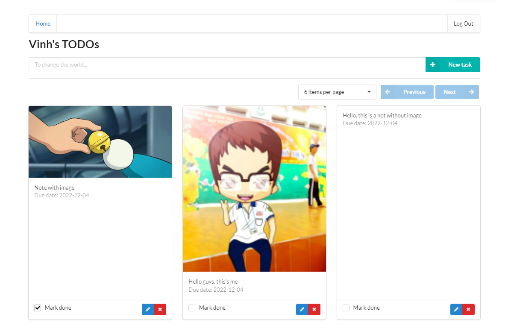
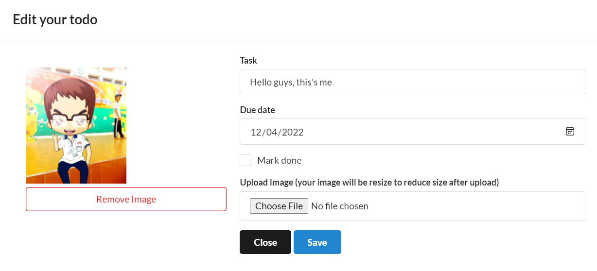

# Udacity Capstone Project

Hello Udacity's mentor, my name is Vinh. This is my capstone project. In this project, I selected Serverless approach and reuse the project in course 4 which I finished before.

## New feature

In this project, I implemented some new feature:

### `Keep user's login session after they refesh browser` 
In original project, if we refesh browser, the application will display Login button again, I think this point is so annoying and I decided to change it by using localStorage.

You can check [my commit here](https://github.com/opdo/aws-clould-capstone/commit/4ee3dde3882ca743b53adc63538c4cbe1ff650cd)

### `The UI now is more beautiful (in my point of view ^^)` 

You can see in [this commit](https://github.com/opdo/aws-clould-capstone/commit/f3efe38dd0c0c21820a19c035366ce0103c4eb27), I enhance todos UI is more beautiful than the original. I learned how to use Gird in sematic ui and change the component.

### `Edit todo in Popup`

In [this commit](https://github.com/opdo/aws-clould-capstone/commit/72c7076dee4155ee2043cec070149495871157ce), I create a Modal that allow user can modify/edit todo's infomation and upload image in a Modal, that is more convenience than the original version.

### `Remove Image`
Now you can click to Edit button and click Remove image, It will delete the image in S3 and set null value in DynamoDb. If you delete todo, the application will delete the image belongs to that todo too.

You can [check this commit](https://github.com/opdo/aws-clould-capstone/commit/9cf6ce032f79e290a499e3755a394af763f229a7)

### `Pagination`
That the things I learned after study in Udacity course 4,  [in this commit](https://github.com/opdo/aws-clould-capstone/commit/a58df0f694190a5b28984e99aa94c20402dae181), I created page size/limit variable and 2 button: Next and Previous.

### `Resize Image after upload`
I think Event Processing is something very exciting in serverless so I implemented a event that listen if any new file upload to S3 successful, the application will resize the image automatically.

After resize the image, it will delete an old image and set new image in dynamodb. You can see [in this commit](https://github.com/opdo/aws-clould-capstone/commit/4835fb075d461236122a3f2dd0a6b667387d56e8)

## Evidence Image Folder

In this repo, I also created a folder name `images/evidence` to capture any screenshot related to deploy, resource.

## And finally,

Thank you for reading, mentor.